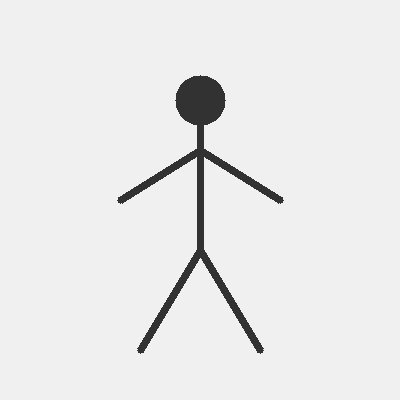

<div align="center">
  
</div>

<p align="center">
  
  
  
  
</p>

# AI Fitness Coach

A real-time AI-powered fitness and yoga coach that uses computer vision and guided pose analysis to help users improve form, count repetitions, and stay consistent with their routine.

This project combines MediaPipe pose landmark detection, OpenCV video processing, exercise scoring logic, and a modern Streamlit dashboard to create a smart training assistant for workouts such as squats, planks, and yoga poses.

---

## ✨ Why this project stands out

- Real-time pose estimation using MediaPipe
- Live exercise guidance and correction feedback
- Repetition counting with movement-state detection
- Workout history stored in SQLite
- Clean, modern dashboard experience built with Streamlit
- Supports both live camera workouts and uploaded images

---

## 🚀 Features

<div align="left">

| Feature | Description |
|---|---|
| Live camera tracking | Detects body landmarks in real time and overlays the skeleton on the webcam feed |
| Form analysis | Evaluates angles to detect posture mistakes and exercise quality |
| Rep counting | Tracks up and down motion to count repetitions automatically |
| Exercise detection | Recognizes supported fitness and yoga movements from body posture |
| Workout analytics | Displays performance stats, timing, and exercise trends |
| History database | Saves completed workout sessions and aggregates form scores |
| User-friendly dashboard | Clean Streamlit interface with visual coaching cards and summaries |

</div>

---

## 🏋️ Supported exercises

- Squat
- Plank
- Warrior Pose
- Tree Pose
- Mountain Pose

Each movement is analyzed through body joint angles to provide actionable feedback such as knee alignment, hip posture, shoulder balance, and form quality.

---

## 🖼️ App preview


---

## 🧠 Tech stack

- Python
- Streamlit
- OpenCV
- MediaPipe
- NumPy
- Plotly
- SQLite

---

## 📁 Project structure

```bash
ai_fitness_coach/
├── app.py
├── requirements.txt
├── README.md
├── .gitignore
├── assets/
│   └── app-preview.jpg
├── core/
│   ├── __init__.py
│   ├── pose_detection.py
│   ├── exercise_analysis.py
│   ├── rep_counter.py
│   └── feedback.py
├── database/
│   ├── __init__.py
│   └── database.py
├── models/
│   └── dataset_pose_references.json
├── train_dataset_model.py
├── fitness_history.db
└── __pycache__/
```

---

## ⚙️ Installation

1. Clone the repository

```bash
git clone https://github.com/sharmilamalaiyarasan/AI_Fitness_coach.git
cd AI_Fitness_coach
```

2. Create a virtual environment (optional but recommended)

```bash
python -m venv .venv
.venv\Scripts\activate
```

3. Install dependencies

```bash
pip install -r requirements.txt
```

4. Run the app

```bash
streamlit run app.py
```

---

## ▶️ Usage

- Open the app in your browser after starting Streamlit.
- Allow webcam access for real-time motion tracking.
- Choose a workout exercise from the interface.
- Follow the live feedback to improve posture and complete reps accurately.
- View workout history and performance summaries in the analytics section.

---

## 📊 Example workflow

1. Start the app
2. Select the exercise
3. Enable webcam
4. Perform the movement
5. Review live form score and feedback
6. Save the workout summary to history

---

## 🧪 Notes

This project is designed for educational and personal fitness-assistant use. The pose analysis system provides real-time guidance based on joint angles and movement thresholds, making it suitable for demo, experimentation, and extensions into more advanced coaching workflows.

---

## 🤝 Contributing

Contributions are welcome. If you would like to improve the workout logic, add more exercises, or enhance the dashboard design, feel free to open a pull request.

---

## 📌 License

This project is available for educational and personal use.

---

## 🔗 Project links

- GitHub: https://github.com/sharmilamalaiyarasan/AI_Fitness_coach
- Demo: Run locally with Streamlit

<p align="center">
  <b>Built for smarter workouts and better form</b>
</p>

