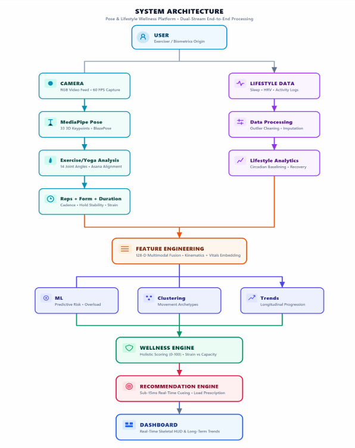
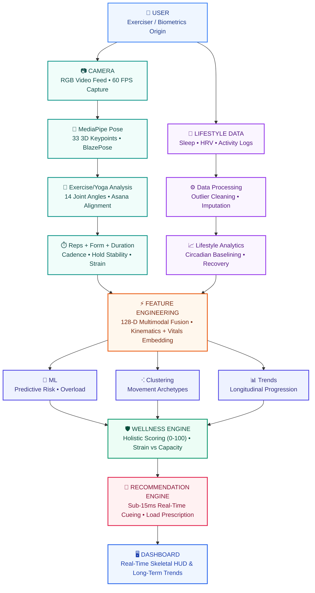

<div align="center">
  
</div>

<p align="center">
  
  
  
  
  
  
  
</p>

# 🧠 AI Wellness Intelligence Platform
### *Dual-Stream End-to-End Pose & Lifestyle Wellness Processing*

An intelligent, multimodal health and fitness analytics platform combining **real-time computer vision pose estimation** with **lifestyle biometric analytics, machine learning, and AI companion guidance**.

The platform is designed around dual-stream architecture: capturing real-time kinematic movement through webcam streams while fusing longitudinal biometric lifestyle data (sleep, activity, heart rate, hydration, stress) to compute holistic wellness scores (0–100), movement archetype clustering, and actionable load prescriptions.

---

## 🏗️ System Architecture

The platform operates via dual-stream end-to-end data processing pipelines that converge into multimodal feature engineering and predictive wellness analytics:

<div align="center">
  
</div>

### 🔄 Architecture Pipeline Overview



---

## ✨ Key Platform Features

### 1. 📷 Real-Time Pose Correction & Rep Counting
- **33 3D Landmark Tracking**: Powered by MediaPipe BlazePose running at up to 60 FPS.
- **14 Joint Angles**: Continuous anatomical calculations for knees, hips, elbows, shoulders, ankles, and spinal alignment.
- **Automated Repetition Counter**: State-machine tracking peak flexion, extension, hold stability, and cadence.
- **Trained Yoga Pose Classifier**: Random Forest model trained on 47+ pose classes from Kaggle yoga posture datasets.
- **Bilingual Voice Coach**: Real-time auditory feedback and form correction in English and Tamil.

### 2. 🔮 "Predict My Wellness Score" with NOVA AI Companion
- **4-Pillar Metric Intake**: Structured inputs across Personal, Activity, Recovery, and Wellness domains.
- **Trained ML Regressor**: Gradient Boosting Regressor ($R^2 \approx 0.94$) trained on 36,500 daily records.
- **Dynamic Anime AI Companion (NOVA)**:
  - 3-second seamless looping animated companion with real-time breathing physics, glowing chest emblem, and floating stars/leaves.
  - Automatically adapts expressions and coaching dialogue across 4 tiers: *Peak Wellness* ($\ge 80$), *Good Balance* ($60-79$), *Moderate Focus* ($40-59$), and *Rest & Recovery* ($< 40$).
- **Wellness Radar Breakdown**: Polar chart visualizing Sleep, Activity, Hydration, Heart Rate, and Stress.
- **Driver Impact & Counterfactual "What If?" Simulation**: Shows category-by-category score impacts and projects score increases achievable through incremental lifestyle adjustments.

### 3. 📊 Population Analytics & User Behaviour Segmentation
- **K-Means Clustering ($k=4$)**: Identifies archetypes: *Healthy Balancers*, *Active Stressed*, *Low-Activity Recoverers*, and *High-Strain Performers*.
- **Circadian Trend Analysis**: Sleep irregularity vs. resting heart rate correlation tracking.
- **SQLite Workout History**: Local, private storage of historical workouts and form scores.

---

## 📁 Repository Structure

```bash
AI_Wellness_Intelligence/
├── app.py                         # Streamlit application entry point
├── requirements.txt               # Dependencies (streamlit, opencv, mediapipe, scikit-learn, etc.)
├── README.md                      # Platform documentation
├── generate_nova_gifs.py          # Script for compiling NOVA companion animated GIFs
├── train_dataset_model.py         # Pose classifier training pipeline
├── fitness_history.db             # SQLite workout history database
├── analytics/                     # Lifestyle analytics and ML predictors
│   ├── lifestyle_insights.py      # Feature engineering and correlation tools
│   ├── ml_wellness_predictor.py   # Gradient Boosting model training script
│   ├── run_pipeline.py            # End-to-end dataset execution pipeline
│   ├── segmentation.py            # K-Means archetype clustering
│   └── wellness_score.py          # Holistic wellness scoring formula
├── assets/                        # Static UI assets and animations
│   ├── architecture_diagram.png   # Dual-stream system architecture diagram
│   ├── nova_avatar.png            # AI companion profile badge
│   ├── nova_companion_high.gif    # Peak wellness looping animation
│   ├── nova_companion_good.gif    # Good balance looping animation
│   ├── nova_companion_fair.gif    # Moderate focus looping animation
│   └── nova_companion_rest.gif    # Rest & recovery looping animation
├── core/                          # Computer vision and biomechanics engines
│   ├── exercise_analysis.py       # Angle math and pose validation
│   ├── feedback.py                # Visual cueing rules and tips
│   ├── pose_detection.py          # MediaPipe PoseLandmarker wrapper
│   ├── rep_counter.py             # Biomechanical state machine
│   └── voice_coach.py             # Multilingual speech audio synthesis
├── database/                      # Data persistence
│   └── database.py                # SQLite schema and session logging
├── models/                        # Serialized ML models
│   ├── dataset_pose_references.json
│   ├── wellness_predictor.pkl     # Gradient Boosting regression model
│   └── yoga_pose_classifier.pkl  # 47-class pose classifier
├── reports/                       # Visual validation and metrics
│   ├── ml_model_metrics.json
│   ├── phase3_lifestyle_analytics.md
│   ├── phase4_ml_prediction.md
│   └── figures/                   # Generated evaluation plots
└── ui/                            # Reusable Streamlit components & theme styling
    ├── components.py
    └── theme.py
```

---

## ⚡ Quick Start & Installation

### 1. Clone the Repository
```bash
git clone https://github.com/sharmilamalaiyarasan/AI_Wellness_Intelligence.git
cd AI_Wellness_Intelligence
```

### 2. Set Up Virtual Environment (Recommended)
```bash
# Windows
python -m venv .venv
.venv\Scripts\activate

# macOS / Linux
python3 -m venv .venv
source .venv/bin/activate
```

### 3. Install Dependencies
```bash
pip install -r requirements.txt
```

### 4. Run the Streamlit Application
Make sure you are in the `AI_Wellness_Intelligence` directory where `app.py` is located:

```bash
streamlit run app.py
```

> [!TIP]
> If you are running from the parent repository directory, use:
> ```bash
> streamlit run AI_Wellness_Intelligence/app.py
> ```

---

## 🖥️ Application Navigation

Once launched in your browser (default `http://localhost:8501`), access the key platform modules from the sidebar:

| Page | Description |
|---|---|
| 🏠 **Dashboard** | Platform overview, quick workout starters, and personal stats. |
| 📊 **Wellness Intelligence** | Overview, lifestyle analytics, ML models, and population cluster profiles. |
| 🏃 **AI Fitness Coach** | Real-time webcam exercise tracker with joint angle overlays and rep counts. |
| 🧘 **Yoga & Pose Analysis** | 47-class asana recognition and posture symmetry scoring (live camera or photo upload). |
| 📈 **Progress & History** | Longitudinal workout logs and session performance trends. |
| 🔮 **Predict My Score** | 4-pillar lifestyle assessment featuring NOVA animated AI companion guidance. |
| 💡 **Recommendations** | Personalized habit adjustments and target thresholds. |

---

## 👥 Contributors & Acknowledgements
- Developed by **Sharmila Malaiyarasan** ([GitHub Profile](https://github.com/sharmilamalaiyarasan))
- Built with **MediaPipe**, **Streamlit**, **Scikit-Learn**, and **OpenCV**.
